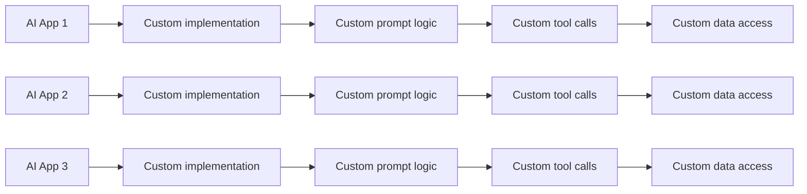
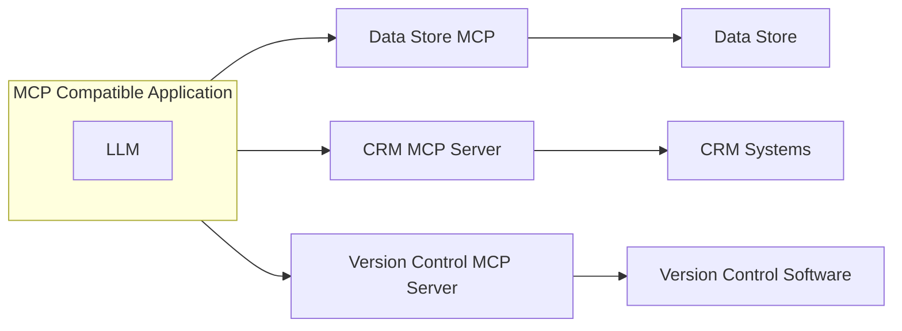

# Why Model Context Protocol?

**Models are only as good as the data given to them**

MCP is an open protocol that standardizes the way how your LLM aplication connect to and work with your **Tools and Data Sources**.

# Protocols

### Rest APIs
Standardize how web app interact with the backend.

### LSP
Standardize how IDEs interact with Language-specific tools.

### MCP
Standardize how LLM apps interact with external systems.

# Whitout MCP: Fragmented AI Development

# With MCP: Standardized AI Development

MCP Servers are reusable by varius AI applications.

- For AI application developers: Coonect your app to any MCP server with 0 additional work.
- For tool or API developers: Build an MCP server once which can be adopted everywhere.
- For AI Application users: AI Application have extensive capabilities.
- For enterprises: Clear separation of concerns between AI product teams.

## Common Questions

- Who authors the MCP Server?
Anyon! Often the service provider itself will make their own MCP implementation. You can make a MCP server to wrap up access to some service.

- How is using an MCP Server different from just calling a service's API directly?
MCP servers provide tool schemas + functions.
If you want to directly call an API, you will be authoring those on your own.

- Sound like MCP Servers and tool use are the same thing?
MCP Servers provide tool schemas + functions already defined for you.