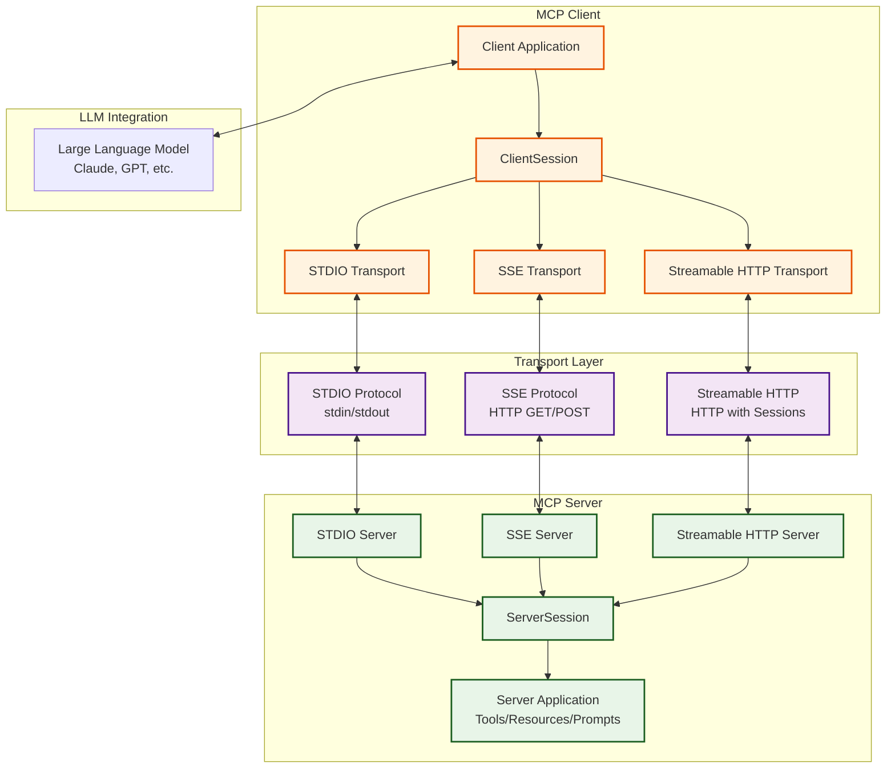
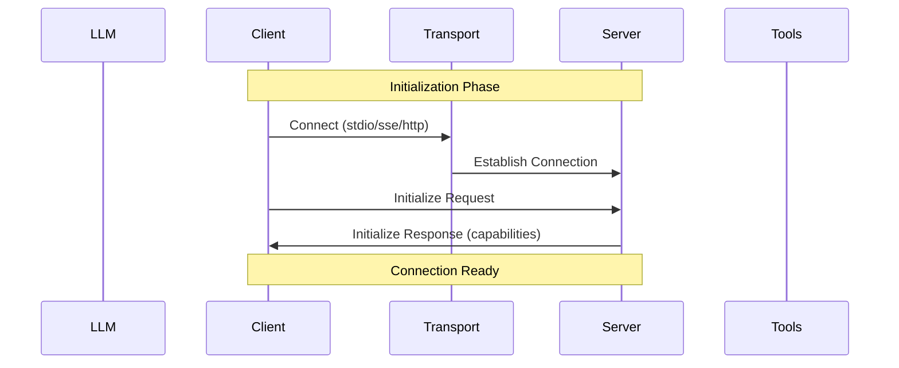
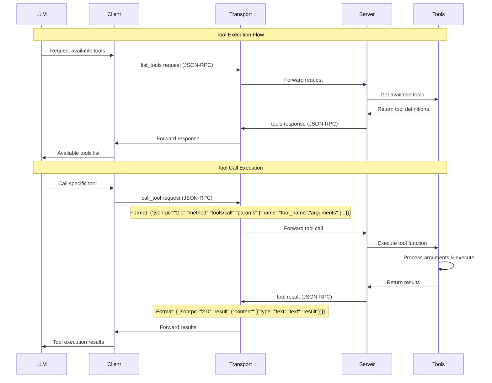

# Transport Protocols in MCP (Model Context Protocol)


## 1. STDIO (Standard Input/Output)

### Characteristics:
- Direct communication through process stdin/stdout
- Simplest and most direct protocol
- Bidirectional communication via JSON-RPC over text streams
- No network configuration required
- Ideal for local processes

### When to use:
- Local development and testing
- Command-line tool integration
- When server and client are on the same machine
- Applications requiring maximum simplicity

### Advantages:
- Minimal latency
- No network overhead
- Easy debugging (messages directly visible)
- Perfect for development

### Disadvantages:
- Only works locally
- One client per server
- Limited for distributed applications


## 2. SSE (Server-Sent Events)

### Characteristics:
- HTTP-based with unidirectional server-to-client streaming
- Uses two endpoints: GET for receiving events, POST for sending messages
- Maintains persistent connection for real-time events
- Compatible with standard web browsers

### When to use:
- Web applications needing real-time updates
- When browser compatibility is needed
- Scenarios where server needs to send frequent notifications

### Advantages:
- Native web standard
- Automatic reconnection
- Works through HTTP proxies

### Disadvantages:
- Being replaced by Streamable HTTP
- Less efficient than WebSockets for bidirectional communication
- Limitations with some proxies/firewalls

## 3. Streamable HTTP ⭐ RECOMMENDED FOR PRODUCTION

### Characteristics:
- Modern HTTP protocol with bidirectional streaming support
- Supports both JSON responses and SSE streams
- Session management with unique IDs
- Support for resumability (reconnection and event replay)
- Stateful and stateless modes
- Support for multiple nodes (horizontal scaling)

### When to use:
- Production applications (RECOMMENDED)
- Distributed systems
- When horizontal scalability is needed
- Applications requiring high availability
- Systems with multiple server instances

### Advantages:
- Best for production
- Horizontal scalability
- Connection resumability
- Load balancer support
- Response format flexibility (JSON/SSE)
- Robust error handling

### Disadvantages:
- More complex to implement
- Higher overhead than STDIO
- Architecture Diagram



# Data Flow and Execution

## 1. Connection Initialization



## 2. Tool Execution Flow



## 3. Data Format
JSON-RPC Messages:

```json

// Request
{
  "jsonrpc": "2.0",
  "id": "req-123",
  "method": "tools/call",
  "params": {
    "name": "get_weather",
    "arguments": {
      "location": "Madrid",
      "units": "celsius"
    }
  }
}

// Response
{
  "jsonrpc": "2.0",
  "id": "req-123",
  "result": {
    "content": [
      {
        "type": "text",
        "text": "Temperature in Madrid: 22°C, Sunny"
      }
    ]
  }
}
```

## 4. **Protocol Differences**

| Aspect | STDIO | SSE | Streamable HTTP |
|---------|-------|-----|-----------------|
| **Transport** | stdin/stdout | HTTP GET/POST | HTTP with sessions |
| **Format** | Line-by-line JSON-RPC | JSON-RPC over HTTP | JSON-RPC + SSE streams |
| **Sessions** | Implicit (process) | UUID in query params | Session ID in headers |
| **Scalability** | 1:1 process | Limited | Horizontal (multiple nodes) |
| **Resumability** | No | No | Yes (with EventStore) |
| **Production** | Not recommended | Deprecated | **RECOMMENDED** |

## 5. **Execution Location**

- **Functions/Tools**: Execute in the **MCP server process**
- **Validation**: Both client and server validate JSON-RPC messages
- **Serialization**: Data is serialized to JSON in transport
- **LLM**: Receives processed and formatted results from the client

**Production Recommendation:** Use **Streamable HTTP** for its robustness, scalability, and support for advanced features like resumability and distributed session handling.
