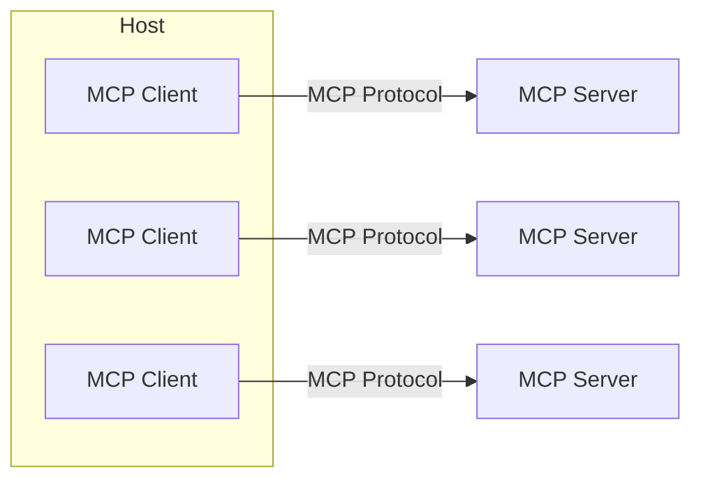

# MCP Architecture

## Client-Server Architecture

# Dictionary

## Host 
LLM applications that want to access data through MCP (ex: Claude Desktop, IDEs, AI Agents, etc.)

## MCP Server
Lightweight programs that each expose specific capabilities through MCP (ex: file system, web browser, etc.)

## MCP Client
Maintain 1:1 connections with servers, inside the host application.

## Tools
Function and tools that can be invoked by the client
  - Retrieve / search
  - Send a message
  - Update DB records

## Resources
Read-only data or exposed by the server
  - Files
  - Database Records
  - API Response 

## Prompt Templates
Pre-defined templates for AI interactions
  - Document Question Answering
  - Code Generation
  - Summarization
  - Output as JSON

# MC Transport

How messages are sent between MCP Clients and MCP Servers

1. For servers running locally: stdio (standard input/output)
2. For servers running remotely:
  - HTTP + SSE (Server Sent Events) (from protocol version 2024-11-05)
  - Streamable HTTP (from protocol version 2025-03-26) 

## Stdio
Client launches the server as a sub process, and the server process writes to stdout and reads from stdin.

## HTTP + SSE / Streamable HTTP
Client makes HTTP requests to the server, and the server sends responses back to the client.

