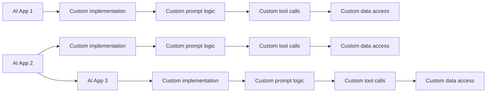

# Why Model Context Protocol?

**Models are only as good as the data given to them**

MCP is an open protocol that standardizes the way how your LLM aplication connect to and work with your **Tools and Data Sources**.

# Protocols

## Rest APIs
Standardize how web app interact with the backend.

## LSP
Standardize how IDEs interact with Language-specific tools.

## MCP
Standardize how LLM apps interact with external systems.

# Whitout MCP: Fragmented AI Development

