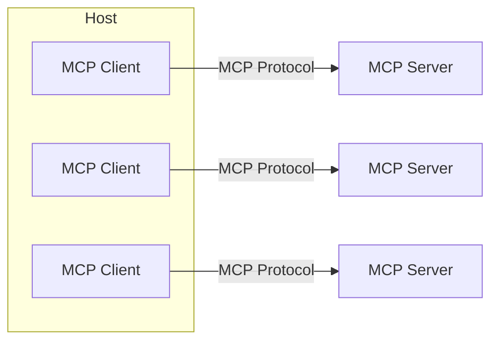

# MCP Architecture

## Client-Server Architecture

```mermaid
graph LR
    subgraph Host
        A1[MCP Client]
        A2[MCP Client]
        A3[MCP Client]
    end

    B1[MCP Server]
    B2[MCP Server]
    B3[MCP Server]

    A1 -- MCP Protocol --> B1
    A2 -- MCP Protocol --> B2
    A3 -- MCP Protocol --> B3
```

