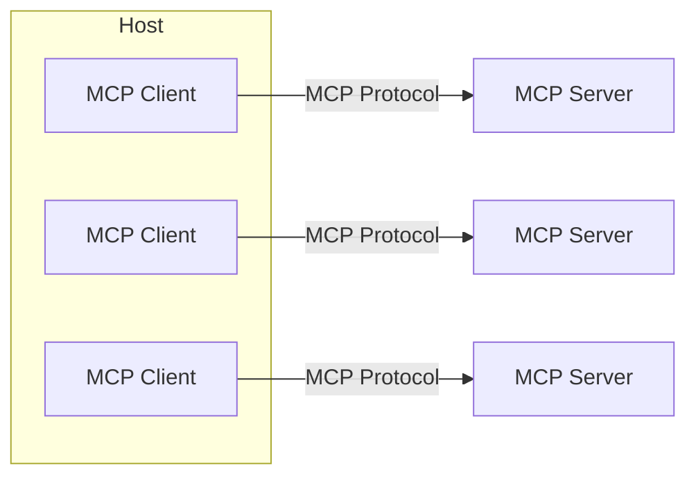

# MCP Architecture

## Client-Server Architecture

# Dictionary

## Host 
LLM applications that want to access data through MCP (ex: Claude Desktop, IDEs, AI Agents, etc.)

## MCP Server
Lightweight programs that each expose specific capabilities through MCP (ex: file system, web browser, etc.)

## MCP Client
Maintain 1:1 connections with servers, inside the host application.

## Tools
Function and tools that can be invoked by the client
  - Retrieve / search
  - Send a message
  - Update DB records

## Resources
Read-only data or exposed by the server
  - Files
  - Database Records
  - API Response 

## Prompt Templates
Pre-defined templates for AI interactions
  - Document Question Answering
  - Code Generation
  - Summarization
  - Output as JSON